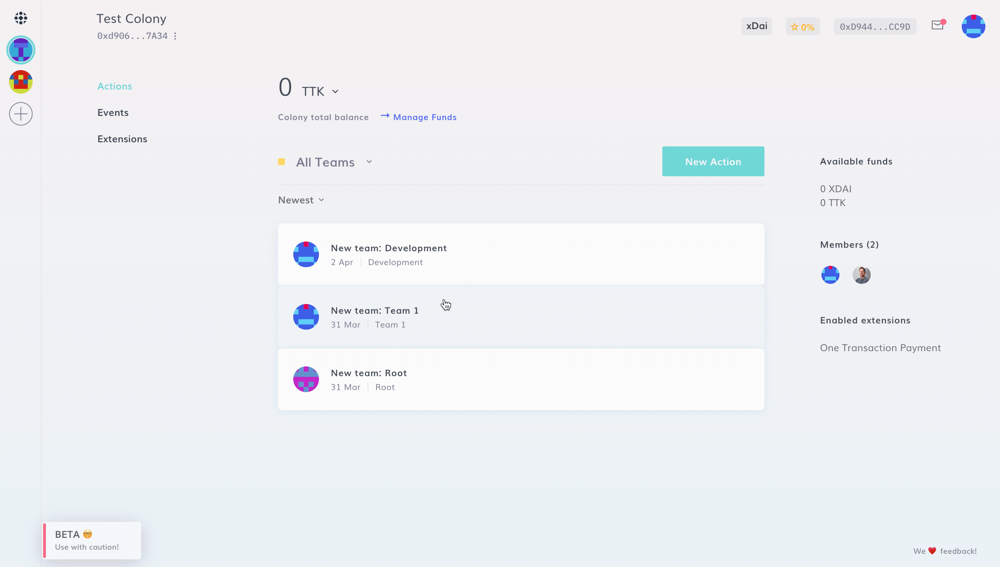

# Managing Permissions in Colony

Permissions in Colony are used to distribute authority within colonies and [Teams](../teams/create-team.md). Permissions help ensure that your colony is secure and that the right users have the right abilities.

To learn more about permissions see (permissions)[../../learn/advanced-concepts/permissions.md].

There are currently 6 different types of permission. To manage them, navigate to **New Action > Advanced > Manage Permissions**.

