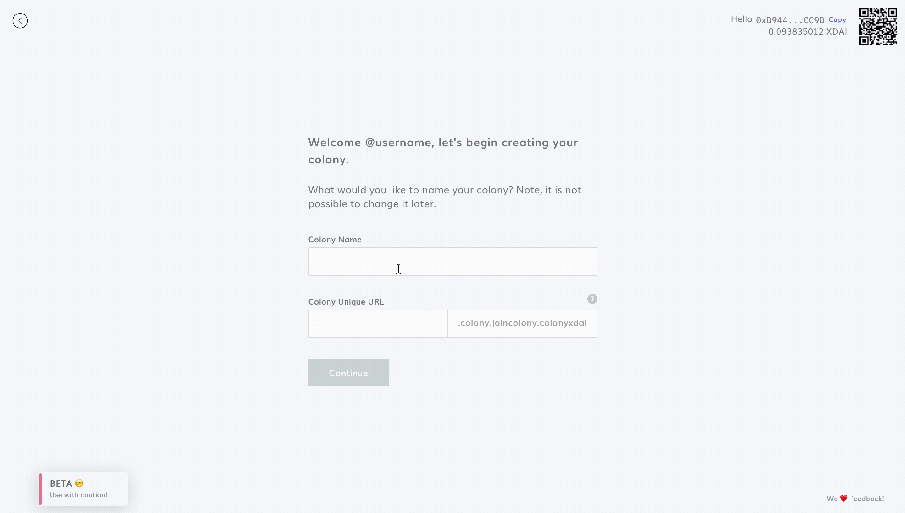
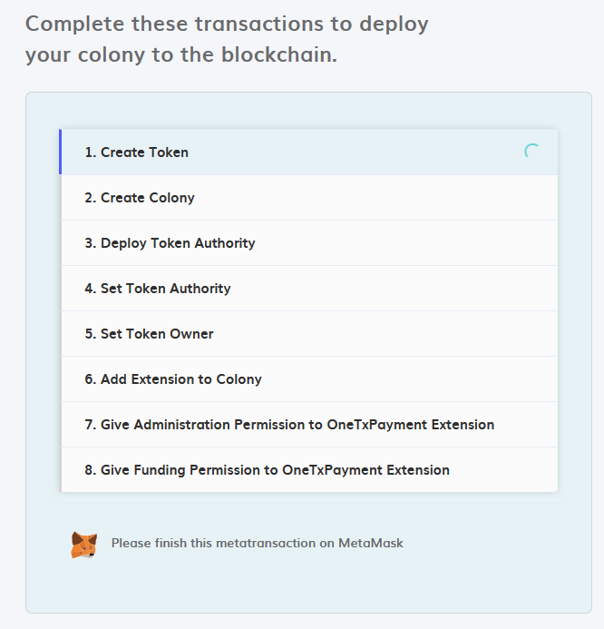
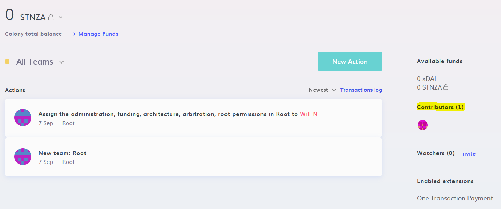
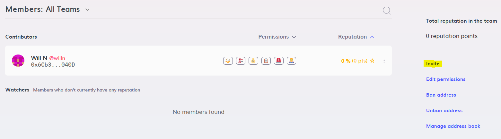
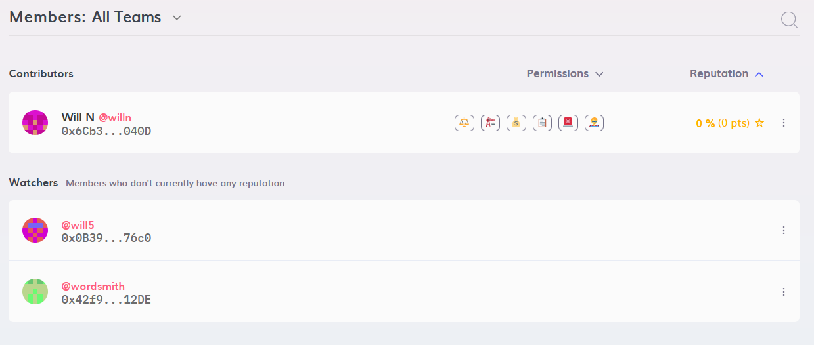
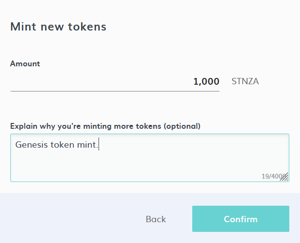
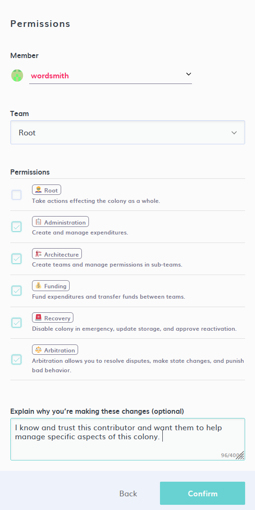
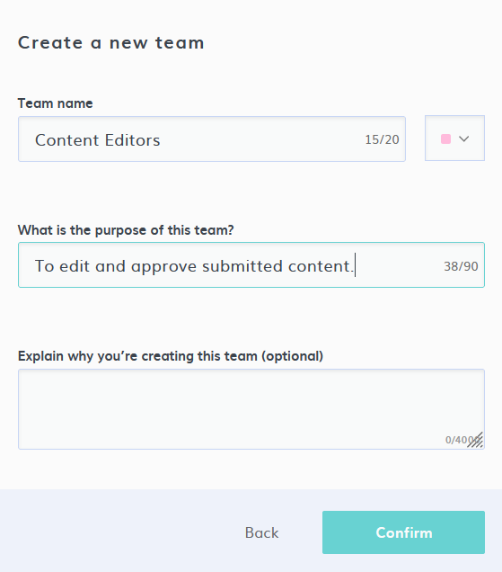
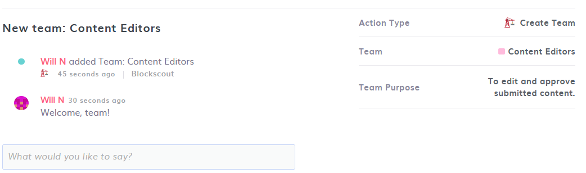

# Launch a Colony

**This guide will get you from zero to DAO in a matter of minutes.**

Each of these seven steps will lay the groundwork for your colony. The entire process can be completed in just a few minutes, so be sure to join the [Colony Community](https://discord.gg/feVZWwysqM) to share your journey with other DAO builders.

## Step 1: Define Your DAO

Once you’ve logged into the [Colony Dapp](https://xdai.colony.io/landing) and connected your MetaMask wallet, you’ll see the option to create a colony. You can then create a name for your colony and set your own unique URL slug.

:::tip

- It's not always necessary to have "DAO" in your Colony name
    - e.g., "Writer's Guild DAO" can just be "Writer's Guild"
- Pick a URL which is easy to remember
    - "MarsSpaceFleetAlpha9000" can be simplified to "marsfleet"
:::

## Step 2: Setup Your Token

Every colony has its own [native token](../key-concepts/native-tokens.md). Payment in a colony’s native token confers [**reputation**](../key-concepts/reputation/) in the team from which it was received.

Users can decide to adopt an existing ERC20 token as their native token (e.g. if your project already has a token), or to create a new one. If you already have an ERC20 governance token, skip to step 2b.

### Step 2a: Creating a New Token

Colony makes it easy to launch a new token from right within the Dapp. Before doing so, it's a good idea to plan out what you want the token name and symbol to be.

### Step 2b: Using an Existing Token

Already have a native token? Specify the token address and see if the token name and symbol are auto-populated. If it's a new token, you may be asked to provide the token name and symbol after pasting in the address.

Once you've set up your token, you'll see a confirmation page where you can double check the details. If it looks good to go, you're ready to launch your colony!

## Step 3: Sign Transactions

Next, you'll need to approve a series of transactions with your MetaMask wallet to get your colony's contracts set up. This process only needs to be ran one time per colony and should only take a few minutes.

Now that your colony has officially been created, you’re ready to bring some contributors on board!

## Step 4: Invite Contributors

After completing the initial setup process, you’ll be brought to your colony's dashboard, which will serve as the home base for your DAO. For now, let's click on "Contributors" to see how we can bring some friends onboard.

On the Contributors page, we'll see a list of all the DAO members, along with their permissions and reputation scores. It's a bit lonely in here, but not for long! Clicking "Invite" will copy our sharable colony URL, which contributors can use to join the group.

When a prospective new member clicks this link, they will see the "Join this colony" option beneath the colony's name. If they're new to using the Colony Dapp, they'll be asked to setup a unique username before joining.

Our colony now has some new members! Since they haven't earned any reputation yet, the new members are known as Watchers.

## Step 5: Mint Your Native Token (if needed)

If you’re using an existing ERC20 token as your colony’s native token, you can skip this step. 

If you've set up a new token, you'll need to mint it before you can pay contributors. This can be easily done by navigating to New Action -> Manage Funds -> Mint Token

## Step 6: Set Up Permissions and Teams

If you have a trusted teammate that wants to help manage your colony, you can grant them specific permissions by navigating to New Action -> Advanced -> Manage Permissions.

Chances are, you'll also want to set up specific domains within your colony, which are known as **teams**. Members within each team can have their own domain-specific reputation score, which gives them the autonomy to pursue their workstreams without bogging down the rest of the organization.

Navigate to New Action -> Manage Team -> Create New Team to get started.

After your new team has been created, you'll be brought to the team landing page, where teammates can leave messages for each other.

## Step 7: Set Reputations

These newest DAO members have indicated their willingness and ability to contribute, so let's assign them to teams and give them some reputation. We can do this in two ways:

1. Paying them in our native token will automatically give them reputation, or
2. We can create an action that gives them reputation without needing to transfer tokens

For today, let's set our reputation score directly. We do this by navigating to New Action -> Manage Reputation -> Award Reputation

Note: make sure that your reputation scores have been adequately weighted to avoid new contributors having an undue amount of influence in your colony. In other words: set your own reputation before sending out payments.

**Congrats! Your colony has now been setup, and you’re ready to [pay contributors](https://colony.gitbook.io/colony/expenditures/payments), launch governance votes, and grow your organization.**