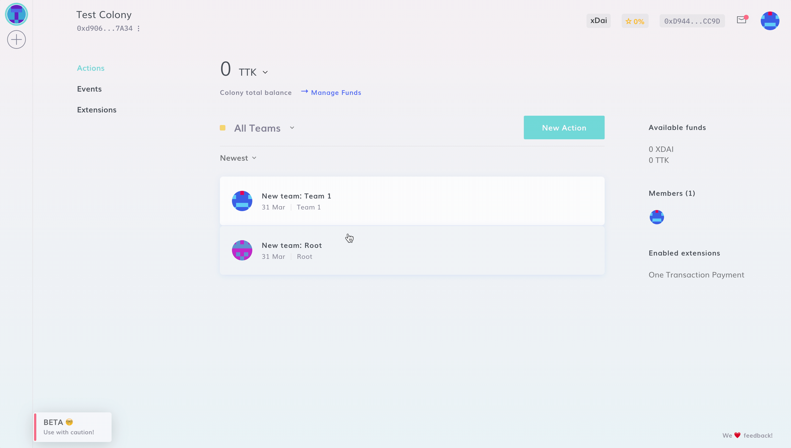

# Create a colony

To create a colony, navigate to [https://xdai.colony.io/landing](https://xdai.colony.io/landing)  :sunglasses:&#x20;

1. Click to "**Create a colony**"
2. Select your colony name & unique URL

:::caution
Please note, colony URLs cannot be changed, so choose carefully!
:::

When you've decided the name of your organization, you can click "**Continue**"! :star\_struck:&#x20;

To create a new colony from the main interface, click on the "**+**" symbol in the left sidebar. Alternatively, you can also click on your profile picture on the bottom right corner of the screen, and select "**Create a colony**".&#x20;

