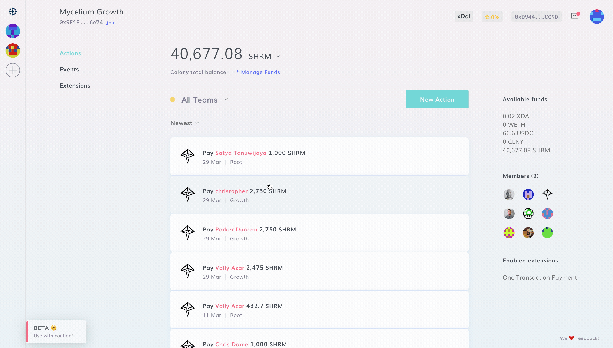

# Browse Teams & Members

### Filter Actions & Events by Team

You can browse Teams and filter Actions & Events by Teams straight from your Dashboard.

### Browse Members by Team

You can navigate to the member's page to browse between all the members in a colony, filter them by Team, and check the reputation they have in those teams, as well as in Root.

Users are ordered by the reputation they have in the team you are watching. All Teams include users that have [joined a colony](../contributor-forge/join-a-colony.md) but have not earned [reputation](../../learn/key-concepts/reputation.md) in it. In fact, to truly call yourself a member of a colony, you'll need to earn some reputation.
