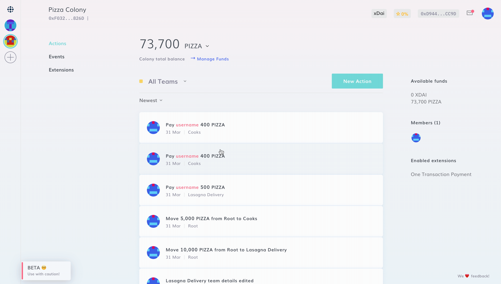
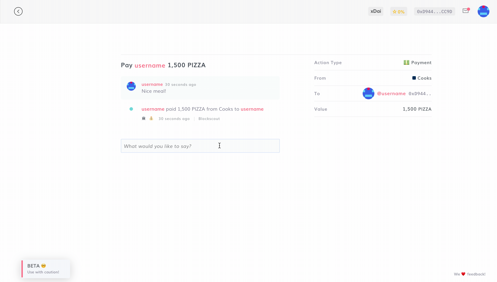

# Payments

To create an expenditure and send a payment in any ERC20 token to any address, simply navigate to N**ew Action > Create Expenditure > Payment** and input:

1. From where you want to send the payment
2. To which Ethereum address
3. Which token and amount you wish to send
4. You can also input details of why you are making this payment (optional)

:::caution
Sending a payment currently requires you to have [**Administration**](../advanced-features/permissions.md#administration) and [**Funding**](../advanced-features/permissions.md#funding) permissions in the domain from which you're creating the expenditure.
:::

:::hint
Only payments in the colony native tokens confer reputation!&#x20;
:::

We encourage interactions between members of a colony. You can leave a comment below every action, such as a payment, or a new Team is created... :sunglasses:&#x20;

