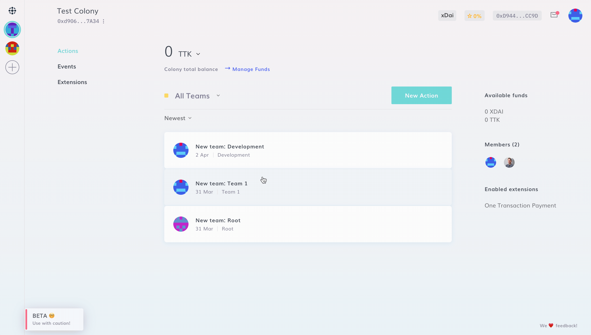

# Permissions

### Manage Permissions

In addition to structuring your organization in [Teams](../teams/create-team.md), you can distribute authority within them.

There are currently 6 different types of permission. To manage them, navigate to **New Action > Advanced > Manage Permissions**.

### Root

Root allows you to take actions affecting the Colony as a whole, such as [changing the colony details](../create-a-colony/edit-colony-details.md) and [minting tokens](../manage-funds/mint-tokens.md).

### Administration

Administration allows you to [create and manage expenditures](../expenditures/payments.md), but not to fund them.

### Architecture

Architecture allows you to set permissions in the active Team, as well as [changing the Team details](../teams/create-team.md#edit-team). Architecture permission in Root allows you to [create and edit Teams](../teams/create-team.md).

### Funding

Funding allows you to [fund expenditures](../expenditures/payments.md), and [transfer funds between Teams.](../manage-funds/untitled.md)

### Arbitration

Arbitration allows you to resolve disputes, make state changes, and punish bad behavior.

### Recovery

[Recovery](recovery-mode.md) allows you to disable the colony in an emergency, update storage, and approve reactivation. Recovery permission is only effective in **Root**.

:::tip
Currently, the only way to distribute authority within a colony is to efficiently set permission in Teams and in Root.
:::
