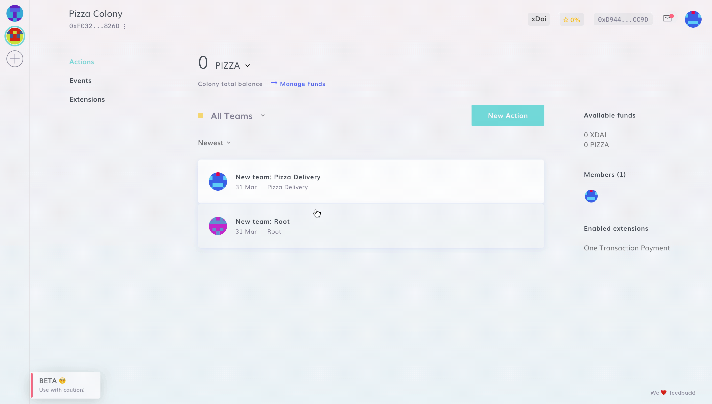

# Colony Address

Every colony has its own **Ethereum Address** that you can use to receive funds from external sources (_i.e. revenues_).

:::danger WATCH YOURSELF
Only send ERC-20 tokens on the xDai network to a colony. If your funds are on another network, you will need to [bridge](https://www.xdaichain.com/for-users/bridges/omnibridge) them to xDai first. **If you send funds directly from any other network than xDai (such as Ethereum mainnet, Polygon, BSC, etc.), your funds will be lost.**&#x20;
:::

Once you've sent or received funds from external sources, you will need to [claim](../manage-funds/sending-funds-to-a-colony.md#claiming-funds) them.

:::tip Don't Forget!
See also [Sending Funds to a Colony.](../manage-funds/sending-funds-to-a-colony.md)
:::
