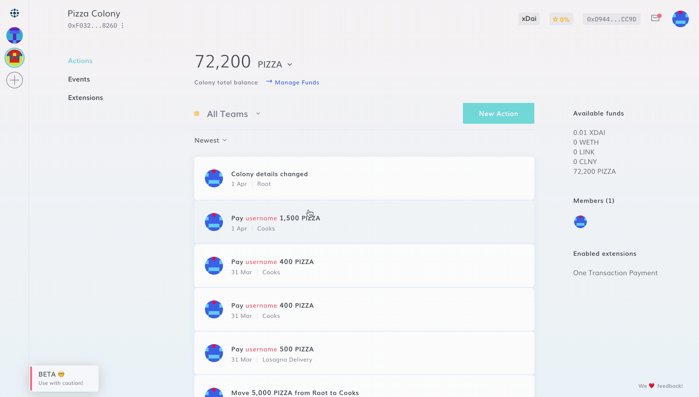
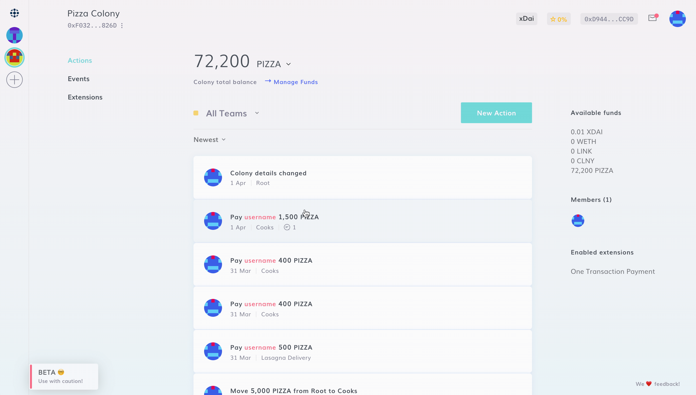

# Sending Funds to a Colony

### Sending Funds

To send funds to your colony, you need to send them to the colony's address you find in the top-left corner of your Dashboard.

:::tip
Make sure to only send **ERC20 tokens on xDai** to your colony.
:::

:::danger
_Do **not** send ETH or any ERC20 tokens from Ethereum directly to your colony._ If your funds are currently on any other chain than xDai, such as Ethereum mainnet, you will first need to bridge them through [OmniBridge](https://www.xdaichain.com/for-users/bridges/omnibridge) before sending them to your colony. Otherwise your funds will be lost irreversibly. Before sending a significant amount of funds, it is advisable to send a small amount for testing purposes first. In case of doubt, please reach out on our [Discord](https://discord.gg/Qjupxvg).&#x20;
:::

### Claiming Funds

Funds sent to a colony address will not appear in the colony's treasury until they are claimed by a member of the colony.

To claim funds, navigate to **Events**, wait for the token transfers to load, and click "**Claim**".

Claimed funds will appear in the **Root** balance**,** and can be later transferred to any other Team using a motion, or by anyone who has the [Funding](../../creator-forge/advanced-features/permissions.md#funding) permission in Root.
