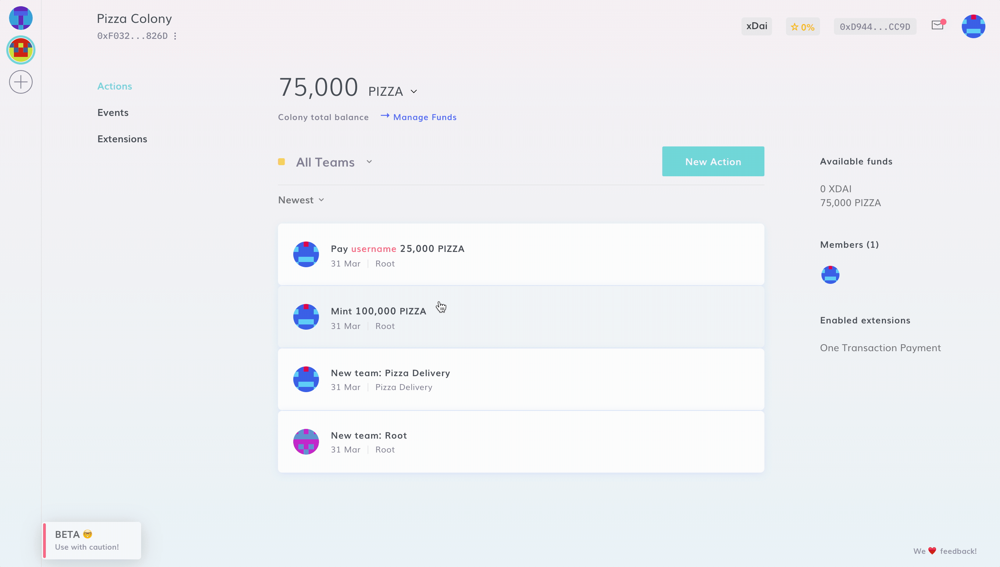

# Payments and Native Tokens

Every colony has its own native token. Native tokens are used for [staking motions and disputes](motions.md).

Payment in a colony’s native token also confers [reputation](reputation.md), but paying in other tokens (such as stablecoins) does not.

Users can decide to adopt an [existing ERC20 token](../../use/launch-a-colony.md#step-2b-using-an-existing-token) as their native token (i.e. DAI or USDC), or to [create a new one](../../use/launch-a-colony.md#step-2a-creating-a-new-token). Native Tokens are a key aspect when creating a new colony.

You can also check the Native Token contract address and add it to your Metamask.

:::info
A colony's native tokens are locked and non-transferrable by default. They can be [unlocked](../../use/managing-funds/unlock-token.md) anytime, so that they may be freely transferred outside of the colony. This action is irreversible and only applies to new tokens created with Colony.
:::
