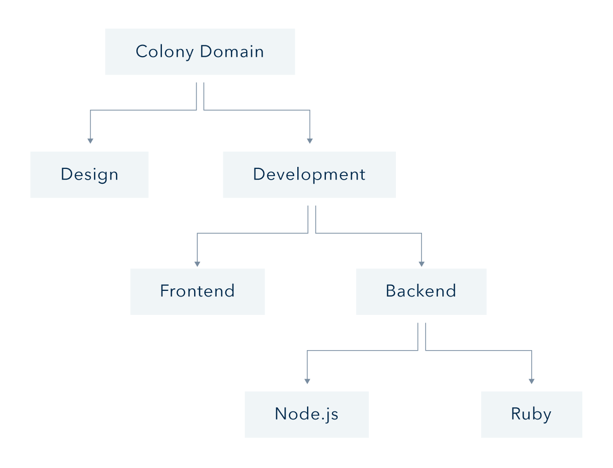

# Reputation

### What is Reputation?

Most DAO frameworks in the past have used token-based governance systems: the more tokens you have, the more voting power you have. This system may work out for whales, but not for everyday DAO contributors that want to participate in the future of work. 

In a Colony, governance power is determined by ***Reputation***, not the size of someone's native token bags. 

Reputation is an off-chain attribute that is calculated through on-chain data and verified by **Reputation Miners**, that stake **CLNY** to provide network updates.

Reputation is an attribute that quantifies a particular individual’s influence and is calculated from the sum of work that has been completed within the colony. Both **native tokens** and **reputation** are required to create motions, raise disputes, and vote.

**Reputation confers influence in a colony by mediating a member's ability to adjust various aspects of the organization.** Whether it is the ability to move funds, create new teams, or settle disputes, reputation determines influence by degrees.

### Can Reputation be Transferred?

Unlike tokens, reputation cannot be transferred between accounts and can only be gained or lost through receiving a colony's native token **(contributions)** or resolving disputes (**participating in the colony governance**).

### Earning Reputation in a Colony

**After you join a colony, you'll need to earn some reputation before you can participate in governance.**

The most common way of earning reputation is by getting paid in the colony's native token. 

:::tip
Payments in stablecoins will not provide reputation. You can use stablecoin payments to adjust for cost-of-living requirements for contributors, or any other situation where making a payment without giving additional reputation is appropriate. 
:::

Reputation can also be manually awarded in special circumstances, such as when launching a new colony with an existing team.

Each colony will have its own rationale for paying contributors. Some colonies may pay contributors for approved content or codebase contributions, while other colonies may send you some native tokens just for asking nicely.

# Earning Reputation in the Metacolony

Are you interested in helping build the Colony ecosystem? You can earn CLNY and reputation by contributing to the Metacolony. Drop a line in the [Colony Discord](https://discord.com/invite/feVZWwysqM) to find out the latest ways you can contribute.  

When a member of a colony receives a payment in the colony native tokens, they earn Reputation in that Team as well as all parent Teams, including Root.

**They do not earn any reputation in child Teams or sibling Teams.**

To make an example, earning reputation as a result of an internal token payment in **Backend**, will earn reputation in **Backend**, **Development,** and in **Root.**

**No reputation** will be earned in child Teams (**Ruby**, **Node.js)**, or in sibling or uncle teams (**Frontend** & **Design)**.

:::tip
Currently, Colony allows **only one layer of Teams**. Nested Teams are forthcoming.
:::

### Reputation Decay

One of the unique characteristics of reputation is that it **decays over time**. This **incentivizes consistent contribution** to a colony, and maintains decentralization by ensuring that reputation represents _recent_ contributions.

Every 600000 blocks, a user’s reputation in every team decays by a factor of 2. **This implies a 'reputation half-life' of about 3.5 months.** Reputation slowly decays on a per-block basis.

To know more about **Reputation Decay**, **Reputation Mining**, and **how it's calculated**, please refer to the [Whitepaper](https://colony.io/whitepaper.pdf).

