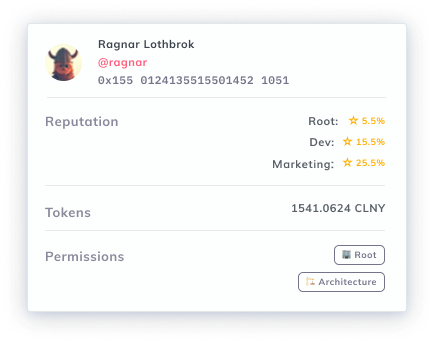

# Teams

Colonies can be made of Teams (aka Domains) such as the **Dev Team**, the **Growth Team**, or the **Meme Team**. 

Teams can be thought of as sub-DAOs which have a degree of autonomy within the parent DAO (known as Root). They can have their own treasuries, launch their own governance processes, and appeal to the wisdom of the Root DAO when there is a dispute. 

### Reputation in Teams

Each Team has its own [reputation scores](reputation.md). When reputation is earned in a Team, a proportion is also earned in the Root DAO.

For example, @ragnar may have 15.5% of the reputation in the Dev Team, but only 5.5% in the Root team. This helps ensure that Team members from every aspect of the organization are fairly represented in Root-level governance processes.

