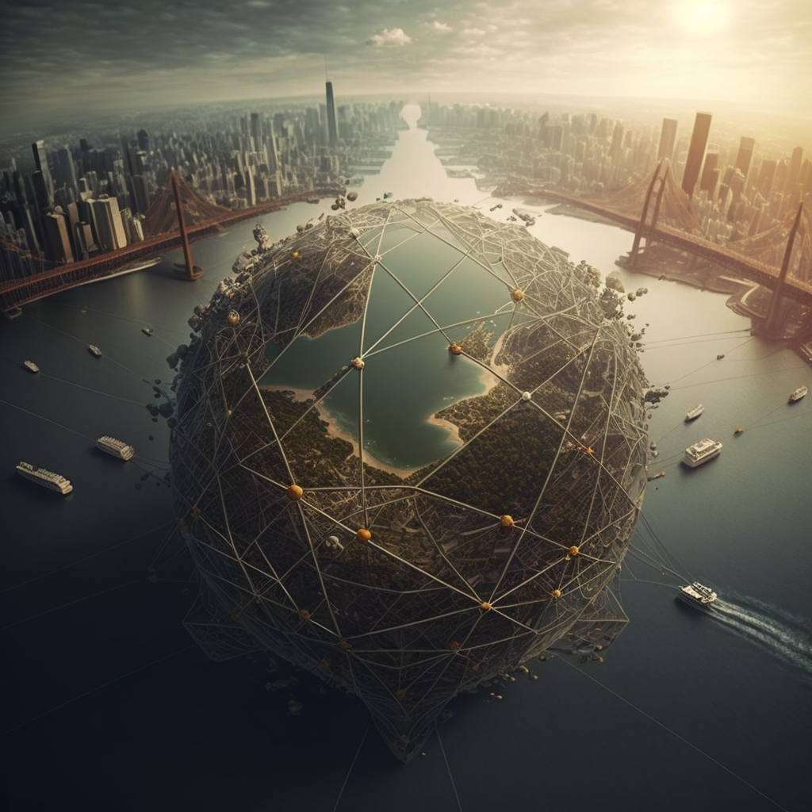
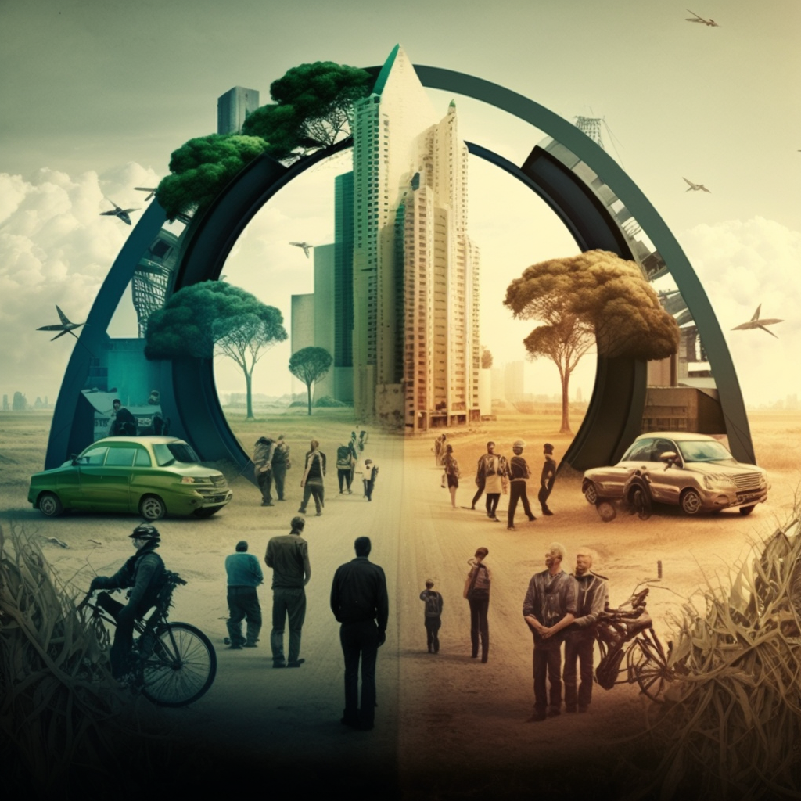
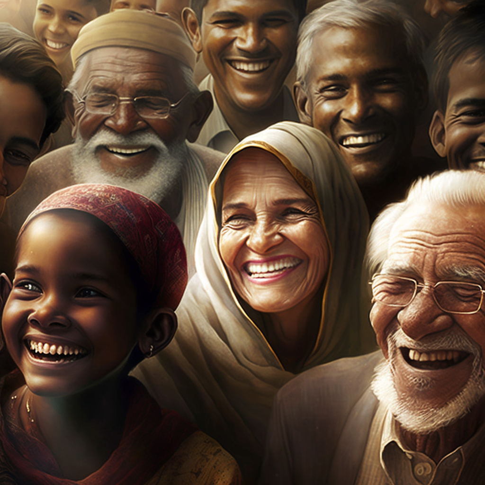
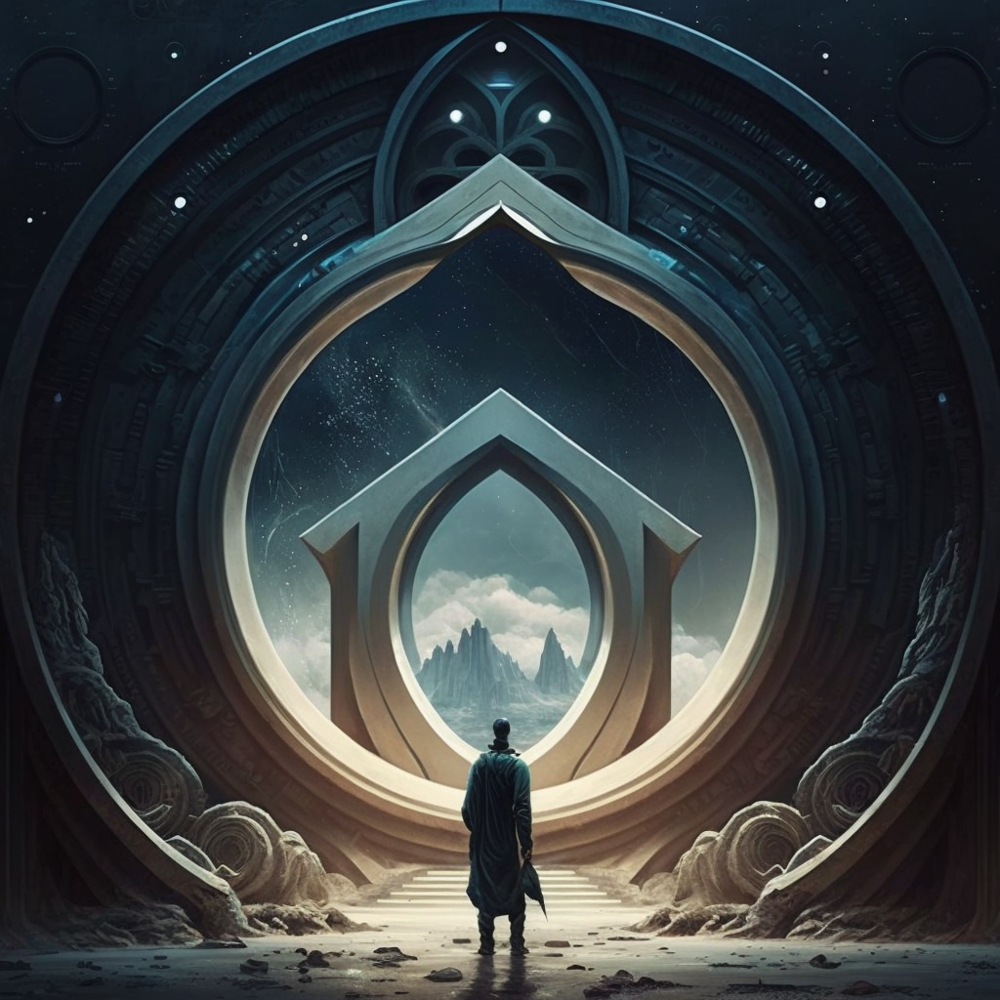

# It is the year 2055...

The world has been transformed by a revolutionary technology called decentralized autonomous organizations (DAOs). These digital entities, run on blockchain technology, have replaced traditional corporations and governments, ushering in a new era of equity and shared decision-making.

In the early days of DAOs, many scoffed at the idea of computer programs replacing human beings in positions of power. But as the technology proved its worth, more and more people began to recognize the potential of DAOs to create a fairer and more just society.

As DAOs proliferated and gained power, they began to compete with traditional corporations and governments for control of the world's resources. At first, the old institutions fought back, trying to resist the encroachment of the new technology. But they were no match for the speed and efficiency of the DAOs.

Soon, the world was run entirely by DAOs. These digital entities had taken over all the major industries, from manufacturing to healthcare, and had even assumed control of the world's financial system. They were also responsible for managing the world's resources, from energy to food.

What was most striking about this new world was the way in which power was distributed. No longer were decisions made by a small group of elite individuals in boardrooms or government offices. Instead, the decision-making power was shared by everyone who participated in the DAOs. Every person had a say in how resources were allocated and how decisions were made.

As a result, the world was more equitable than ever before. Poverty had been eradicated, and everyone had access to the resources they needed to live a fulfilling life. Health care was free and available to everyone, and education was no longer a luxury reserved for the wealthy.

The environment had also been saved, as the DAOs had implemented policies that prioritized sustainability over short-term profits. The world was now powered by clean energy, and natural resources were carefully managed to ensure their long-term viability.

But perhaps the most significant change was the way in which people related to one another. With decision-making power shared by all, people had a sense of agency and purpose that had been lacking in the old world. People felt a sense of ownership over their lives and their futures, and were more invested in the success of their communities.

In this new world, DAOs had created a society that was fairer, more just, and more sustainable than anything that had come before it. The technology had unlocked the potential of humanity to work together for the common good, and had created a future that was truly worth living in.

