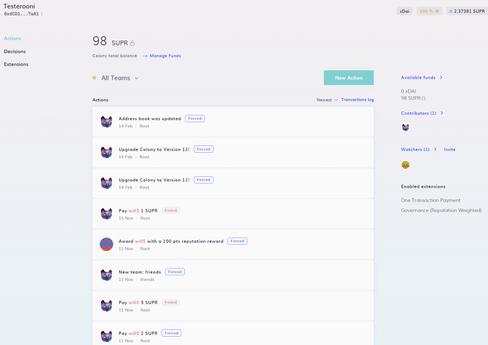
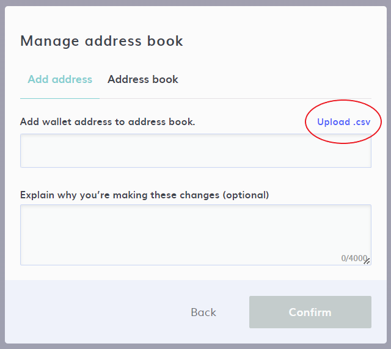

# Address Book

The Address Book feature allows contributors to quickly identify verified wallet addresses in a colony. By adding a wallet address to the Address Book, the address will be shown in the members list with a green check mark. 

This feature helps keep your colony secure against imposters and other bad actors. User selection inputs throughout the Colony UI will only show addresses that are in the Address Book and will warn you if you're interacting with an unapproved address.

## Adding a trusted address

To add an address to the colony's Address Book, navigate to **New Action -> Manage Teams -> Manage Address Book** and add the new address. You can annotate this new address addition to let other members of the colony know why you are adding this address.

## Adding bulk addresses

You can add addresses to the Address Book in bulk by uploading a .csv file. You can add a list of addresses to the first column on the supplied template.

## Viewing the Address Book and removing addresses

To view the colony's Address Book and remove addresses from it, navigate to the **Address Book** tab on the **Manage Address Book** modal. Uncheck an address to remove it from the book.  

## Disabling Address Book

If you want to disable the Address Book feature and remove the warning in your colony when interacting with unknown addresses, you can disable the Address Book function.

:::caution
Disabling the Address Book function can make your colony more vulnerable to malicious actors.
:::

