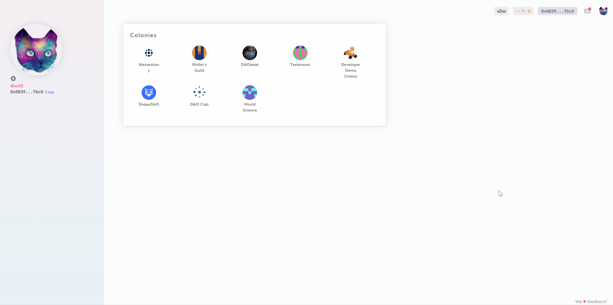

# Metatransaction Errors

Metatransactions (also known as [Gassless transactions](../advanced-features/gasless-transactions.md)) make using Colony free, but are sometimes incompatible with legacy features such as unwrapping CLNY tokens. 

If you run into an error involing Metatransactions, not to worry! It's easy to disable and re-enable this feature. 

## Enabling and Disabling Metatransactions

Metatransactions are enabled by default. To disable or re-enable Metatransactions, click on your profile icon and navigate to your **Settings** page. 

Then, click the **Advanced Settings** tab. Here, you'll see the option to turn Metatransactions on or off. 

Once you've made your selection, click **Save** and retry the transaction that produced the error. 

