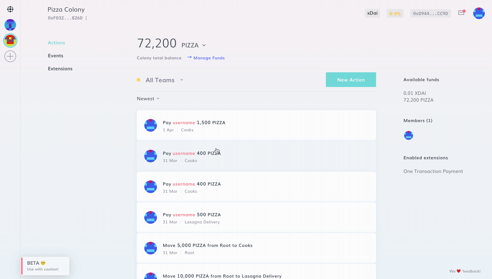
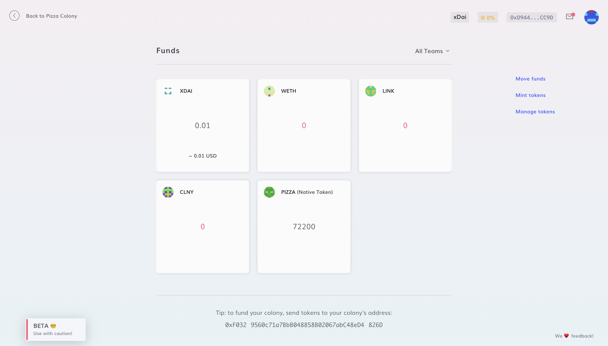

# Adding Tokens to DAO Treasury

Much like Metamask or any other Ethereum wallet, before sending unknown tokens to your colony, you need to add their contract before they are recognized.

To add a token to your colony, navigate to **New Action > Manage Funds > Manage Tokens** – you'll find a list of the most common ERC20 tokens, or you can add them manually by pasting the token contract address.

:::danger
Please add the xDai contract of the token you want to use. You can find them on [Blockscout](https://blockscout.com/poa/xdai/). Do not send main net tokens to your colony.
:::

Once you've added them, you can review your tokens by clicking on "**Manage Funds**" or "**Available Funds**" in the Dashboard.

