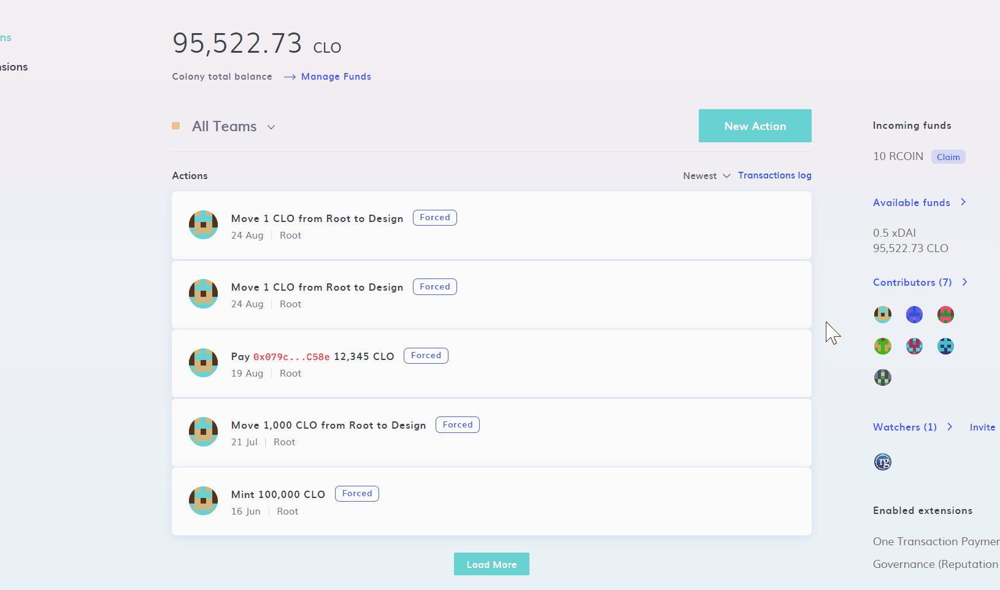
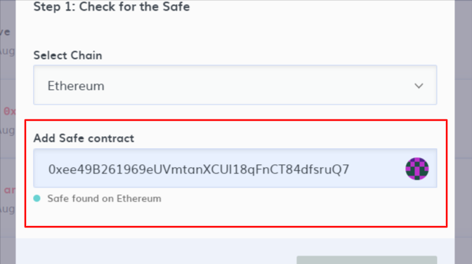
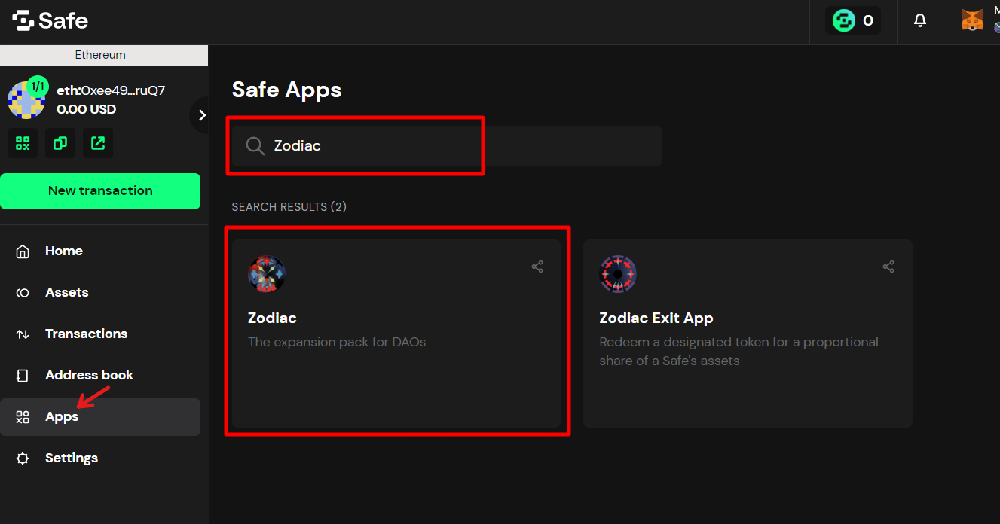
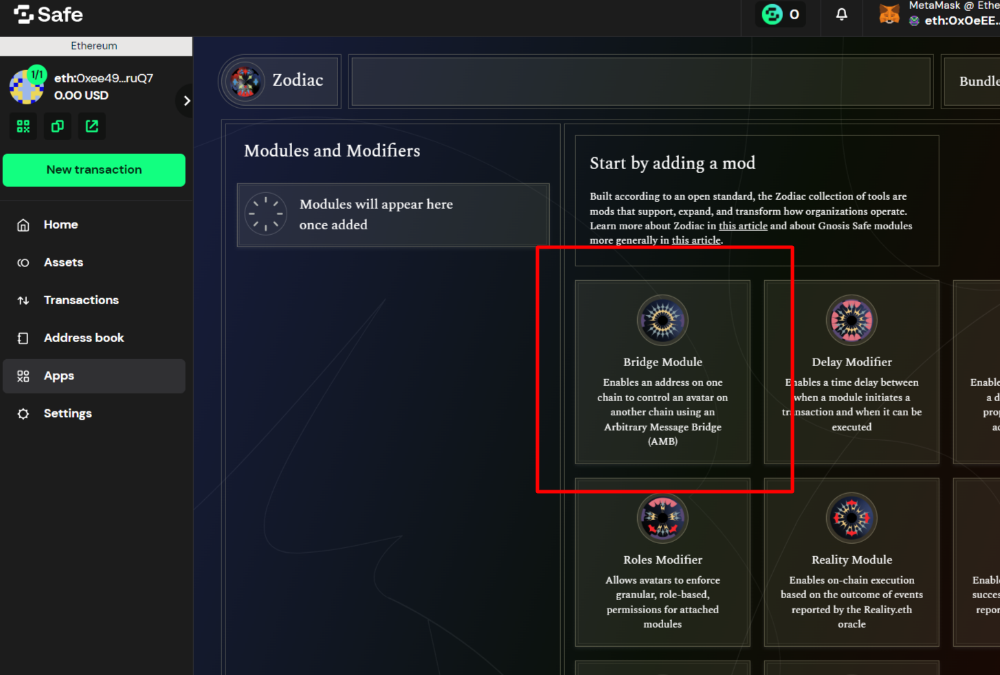
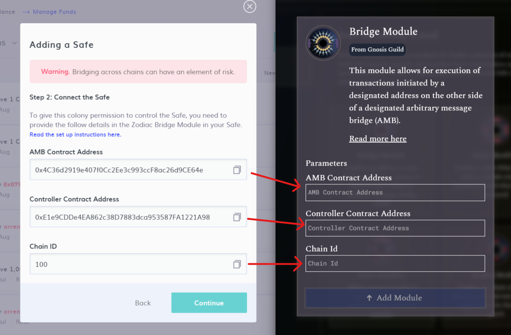
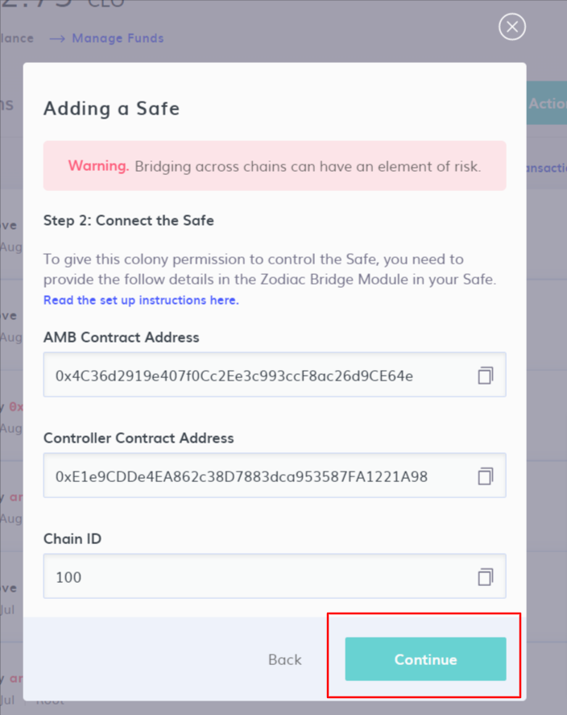
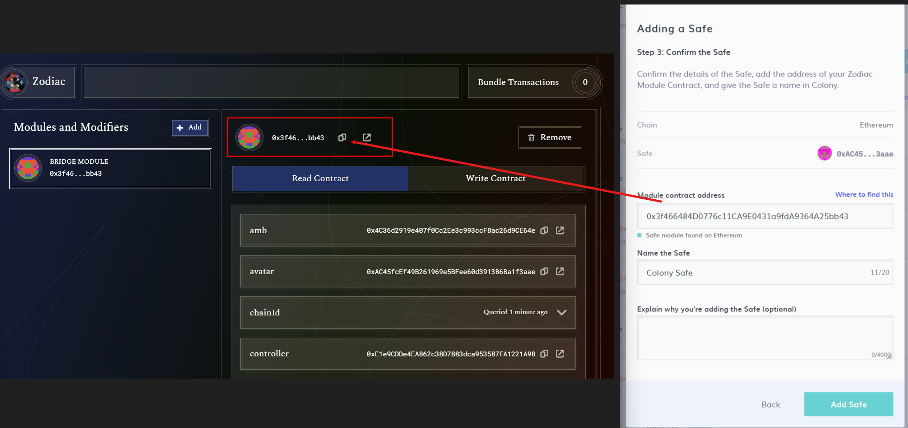

# Adding a Safe

A guide on how to add and use your Safe within Colony.

:::info
Currently supported chains are **Ethereum Mainnet** and **Binance Smart Chain** (BNB). More chains will be added as suitable bridges are made available.
This process will require you to switch back and forth between chains to perform the required transactions and there will be gas costs to setup the Safe.
:::

### What you will need

* A Safe on one of the supported chains.
* Funds on the Safe's chain (ETH or BNB) to cover the transaction costs to set up the module.
* Permission to create the transaction in the Safe and enough signers on board to co-sign.
* Approximately 5 - 10 minutes to complete the full set up.

## Adding a Safe

In order to add a Safe to your colony you will need to complete all of the following steps:

### Step 1: Check for the safe

The first step is to locate your Safe's contract address and add it to your colony. To get started, click on the "New Action" button on your Colony home page and then navigate to "Advanced", then "Safe Control", then the "Add Existing Safe" option.

You can find the chain and the address by accessing your Safe here: [https://app.safe.global/](https://app.safe.global/)

Select the correct chain of your Safe, make sure it is on a chain from the list of currently supported chains on Colony.

Copy the address, make sure to not include the chain prefix e.g. "eth:".

Then add it into the "Add Safe contract" input field. The address will then be automatically validated for you to ensure that is accessible on the selected chain.

### Step 2: Connect the Safe

With the details from the previous step, you will now be able to give permission to your Colony to control the Safe. If you navigate to the **Apps** screen in your Safe, you can **search "Zodiac" in the search input** to find the right app, then just click on the "Zodiac" app.

> Note: You may need to accept a disclaimer after you have clicked on the Zodiac app.

Within the Zodiac app, look for the "Bridge Module" and click on it in order to install it.

The fields provided within the Adding a Safe steps on Colony should align with the fields available when adding the module on Safe. Copy and paste the fields from Colony over to the module settings fields to continue.

> Note: You will likely need to switch the chain your wallet is connected to, if you are doing the whole process in the same browser, to be the same chain as your Safe is on.

Once you have added all the required values and double checked them, click the "Add Module" button. You will need to perform a transaction in the Safe in order to add the module, so review the details of the transaction and confirm it.

If you have multiple signatures required in your Safe, you will need to make sure that enough signatures are made before the module is actually installed.

### Step 3: Provide module address and add Safe

The final step of the process is to confirm the Safe and to let Colony know of how to connect to the newly added Bridge Module.

So, returning to Colony, on Step 2 of the "Add a Safe" process, click on the "Continue" button to go to step 3.

:::danger Important
If returning to Colony you find you no longer have "Add a Safe" process up, you can return to the same step by clicking on "New Action", then "Advanced", then "Safe Control", then the "Add Existing Safe" option, select the right chain and enter the Safe address again. The details on step 2 will be the same.
:::

#### Finding the Module contract address

To find the module contract address, return to **Apps > Zodiac**, then click on the newly installed module as shown in the below screenshot.

Then copy the address at the very top of the module details screen. You can see this highlighted in the image below. Add this into the "Module contract address" field on Colony.

You can then enter in a name for the Safe to identify it on Colony and click 'Add Safe'. 

Colony will now be set up to control the Safe on the other chain. The next step is to see it in action by creating a transaction.

See [**controlling a Safe.**](controlling-a-safe.md)
