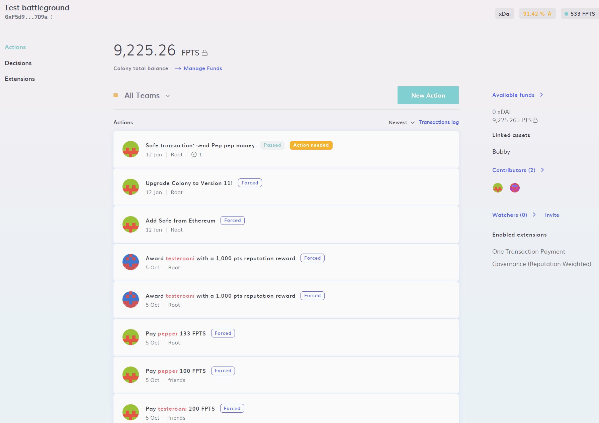

# Controlling a Safe

### Control a Safe (formerly Gnosis Safe) on another chain using your Colony’s governance mechanisms.

Once your [Safe has been added](adding-a-safe.md), you can control it using the [Motions](../../governance/motions-and-disputes/) process. 

### Step 1: Launch the Safe Control menu

From your colony's home page, click on the "New Action" and then navigate to "Advanced" -> "Safe Control" -> "Control Safe".

### Step 2: Choose your transaction type

Select your Safe and transaction type. There are four types of transactions available:

* **Transfer funds:** Allows you to trigger a transfer of funds from a Safe
* **Transfer NFT:** Allows you to trigger an NFT transfer from a Safe
* **Contract interaction:** Allows you to directly interact with smart contracts on the same chain as the Safe. This enables almost unlimited possibilities to use Colony to govern smart contracts
* **Raw transaction:** Allows greater control over how a transaction is executed. This is useful for those with advanced use cases

### Step 3: Enter transaction parameters and create transaction

Now's the time to fill out the details of your transaction and launch the [Motion](../../governance/motions-and-disputes/). Each transaction type has its own set of parameters. Remember that the recipient of any token transfers will need to be on the same chain as the Safe. 

**Transfer funds:**

This allows you to trigger a transfer of funds from a Safe on another chain to a nominated address on that chain.
* Select the token type and amount of tokens that you wish to send from the Safe
* Input the address of the recipient. Make sure that the recipient's address is on the same chain as the Safe!

**Transfer NFT:**

This allows you to trigger an NFT transfer from a Safe on another chain to a nominated address on that chain.
* Select the NFT you wish to transfer
* Select your recipient 

:::danger For Devs Only
The following Safe Control features are advanced and should only be used by developers and power users. Proceed with caution!
:::

**Contract interaction**

This allows you to directly interact with smart contracts on the same chain as the Safe, enabling virtually unlimited possibilities to use Colony to govern any smart contract.

* Target contract address
* ABI/JSON

**Raw transaction**

This allows for greater control over how a transaction is executed.

* Recipient
* Value wei
* Data bytes

Finally, just click **Create Transaction** and your Motion will be launched!

Need to remove a Safe from your Colony? See [Removing a Safe](removing-a-safe.md)