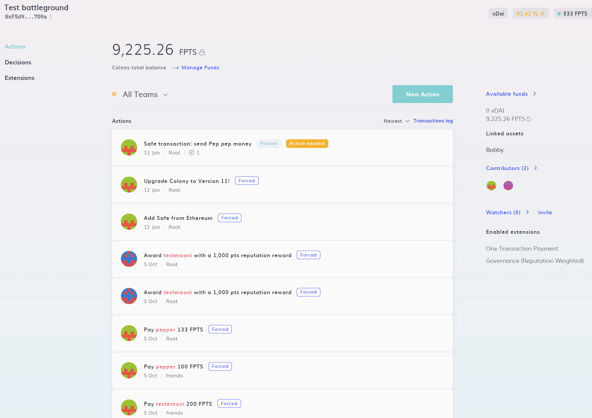

# Removing a Safe

Want to disconnect a Safe from Colony?

Simply navigate to Actions -> Advanced -> Safe Control -> Remove Safe and select the Safe you'd like to remove.

:::note
This action only removes the Safe from Colony, it does not install the module from your Safe.
:::
