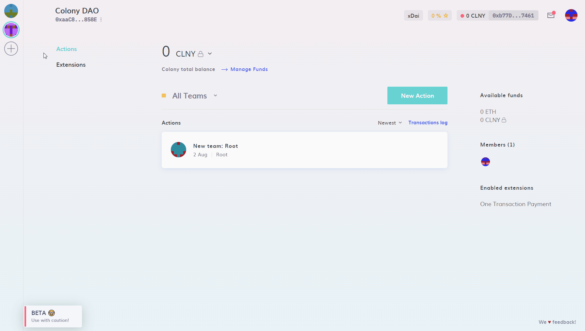
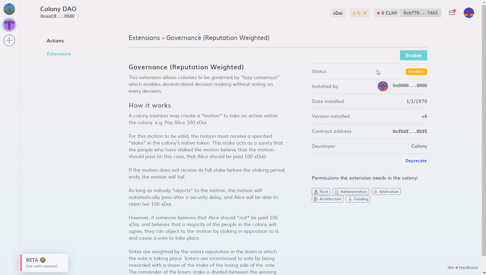
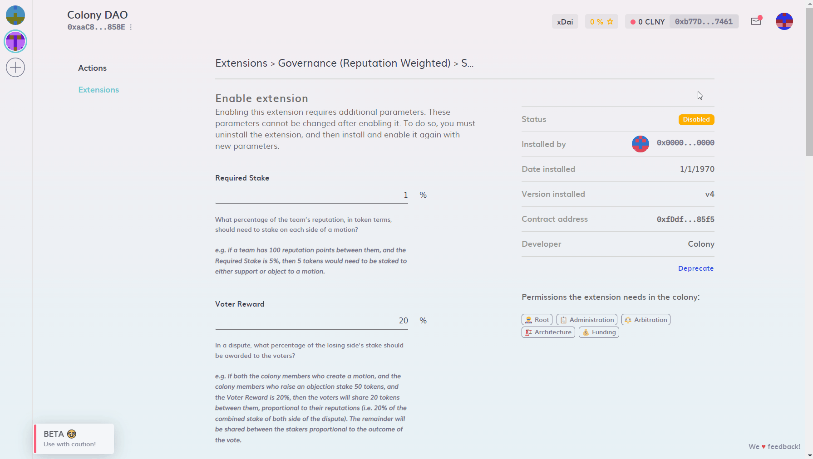

# Installation

Governance (Reputation Weighted) is an extension that is disabled by default. To see whether this feature is already installed and enabled, click on "Extensions" on the left-hand side of your colony's main interface and look for "Governance (Reputation Weighted)".

If it is listed under "Installed Extensions" and enabled, you are good to go.

Otherwise, follow these steps:

1\. Make sure your account has Root permissions or speak to someone who holds your colony's Root permission.

2\. Click on "Extensions", select "Governance (Reputation Weighted)", click on "Install" and confirm the transaction in your wallet.

3\. Review the settings, click on "Confirm" and confirm the transaction in your wallet.

:::note
For a detailed description of these settings, default values and recommended values for testing purposes, see the next page "[Parameters](https://colony.gitbook.io/colony/extensions/motions-and-disputes/parameters)".&#x20;
:::

4\. Once all transactions are confirmed and the status changes from "Disabled" to "Enabled", the extension has been successfully installed.

