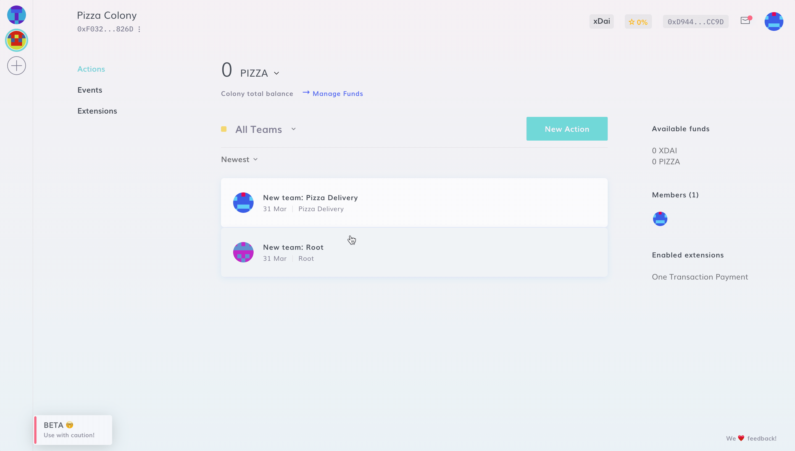
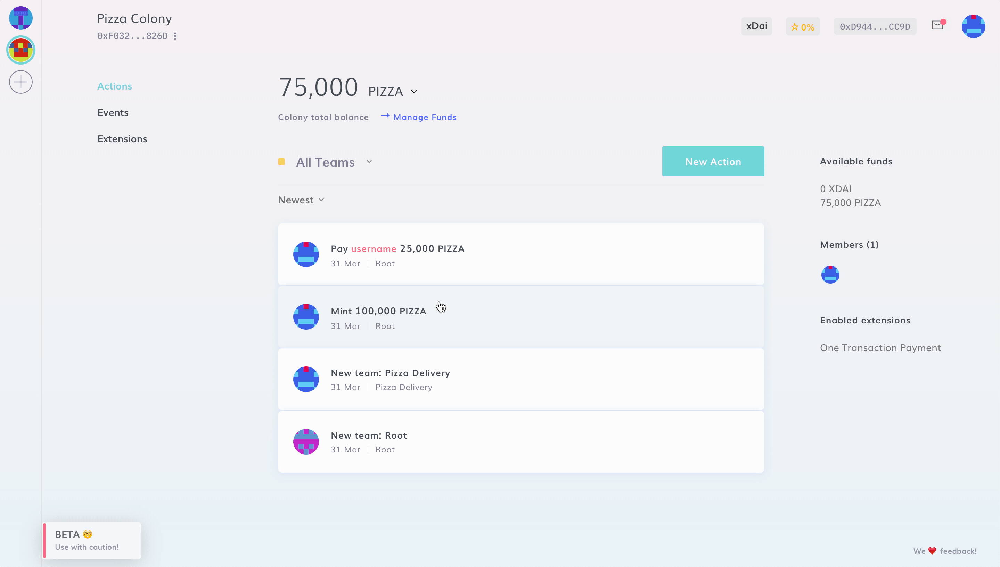

# Native Token Address

If you've decided to create a Colony using a new token, you can navigate to the top left corner of your dashboard, and click on the three dots to find your **native token contract address**.

You can add that address to Metamask, and check your native token balance there.

