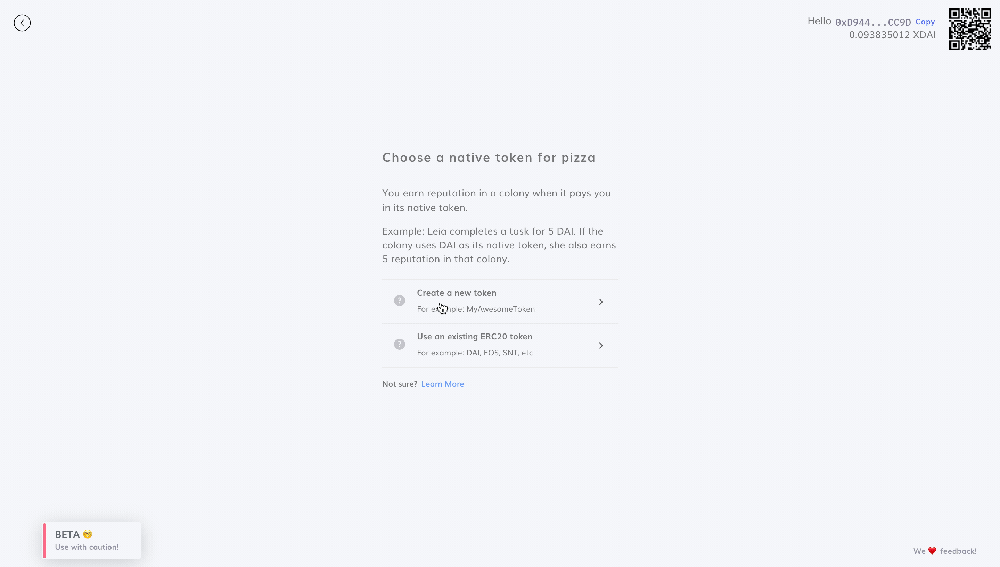
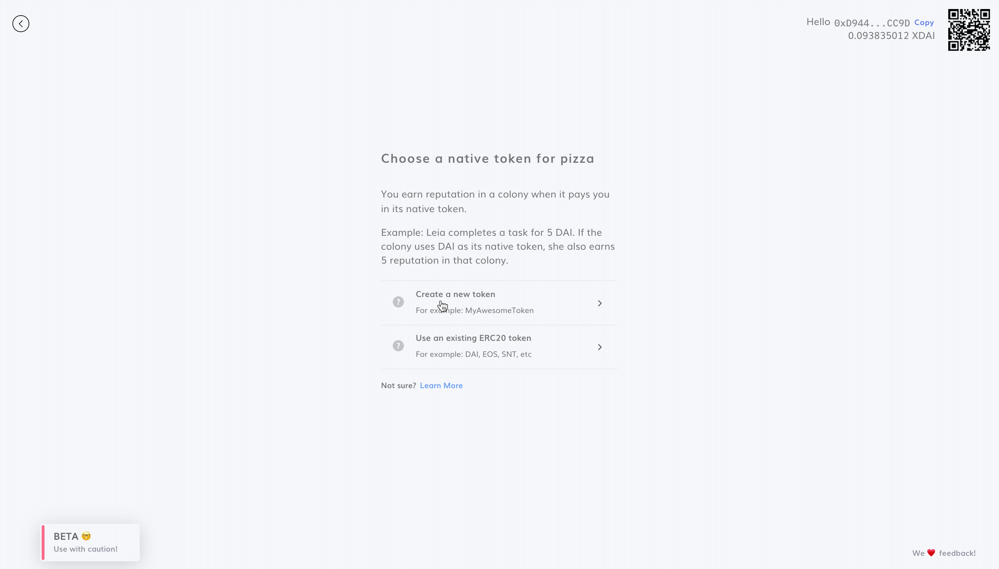

# Select Native Token

Every colony has its own [native token](../key-concepts/native-tokens.md). Payment in a colony’s native token confers [**reputation**](../key-concepts/reputation/) in the team from which it was received.

Users can decide to adopt an existing ERC20 token as their native token (e.g. if your project already has a token), or to create a new one.

### Use an existing ERC20 Token

Select this option if your project already has an existing token.


If you're using an existing ERC20 token as your native token, please use the [xDai bridged version of the contract](https://www.xdaichain.com/for-users/bridges/omnibridge).


### Create a New Token

Select this option if your project doesn't have a token yet, and wishes to have more control over their token using Colony. 


**Pro Tip** :sunglasses: **:** you can use emojis for your token symbol! :grin: 



You cannot change your colony's [Native Token](select-native-token.md). Please choose carefully.


