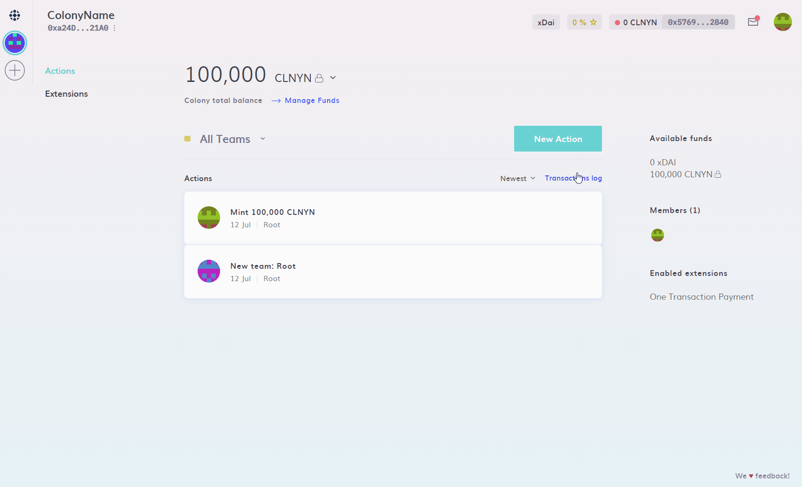
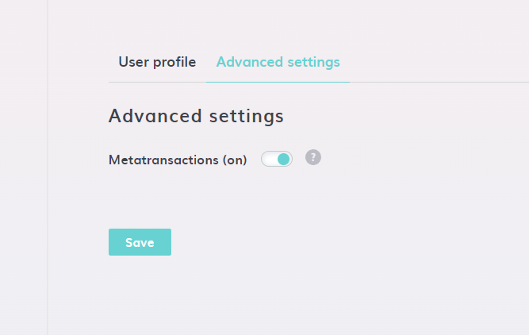

# Metatransactions

In order to reduce the steps required to get started with using Colony, Metatransactions is a feature that will cover your gas fees when performing any action on Colony that requires a transaction. Now, all you need to do is sign the transaction.

This saves any user from needing to have xDai in their wallet in order to use Colony.

### Disabling / Enabling

You are able to disable and enable Metatransactions at any time from within your User Settings. This is locally stored, so, you will need to repeat this on any new device you use.

This would be useful if you would rather cover your own gas fees on Colony, or you need to temporarily disable the feature in order to perform the transactions required to update your existing Colony, so that it meets the prerequisites.

To disable / enable, Click on your 'Avatar' and click 'Settings'. On the 'Settings' page go to the 'Advanced settings' tab. You then have an option to toggle the Metatransactions setting on or off.

.png>) 

### Prerequisites


If you are creating a new Colony, then you won't need to worry about this at all. Metatransactions will just work for you.


Support for Metatransactions has been added in Colony v9, One Transaction Payment extension v3 and Governance (Reputation Weighted) extension v4.

So, if you have an existing Colony then in order for Metatransactions to work, your Colony needs to be upgraded to at least v9, the One Transaction Payment extension to at least v3 and Governance (Reputation Weighted) extension to at least v4.

> Note: You will need to disable the Metatransactions feature in your user settings as described above in order to be able to update your Colony and Extensions. If you don't you will see the following error:

.png>)

Visit this page for details on how to: [Upgrade your Colony and Extensions](upgrade-colony-and-extensions.md)

