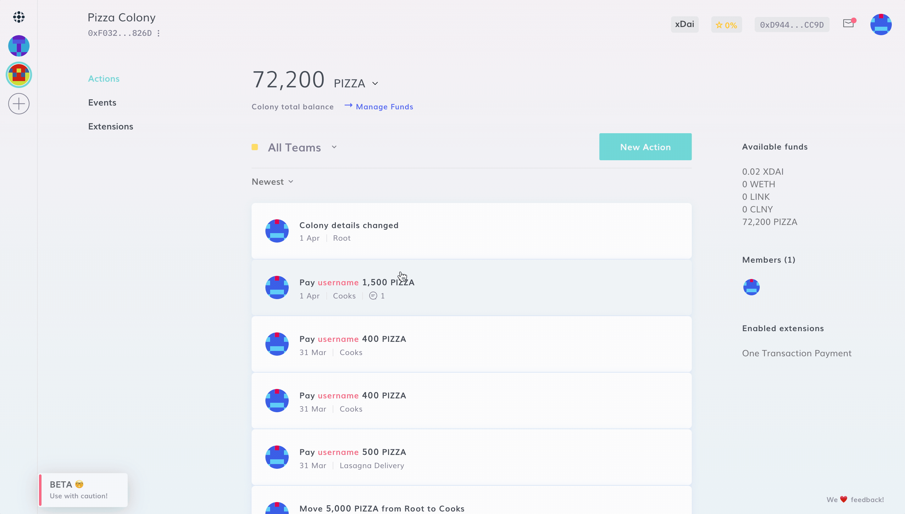
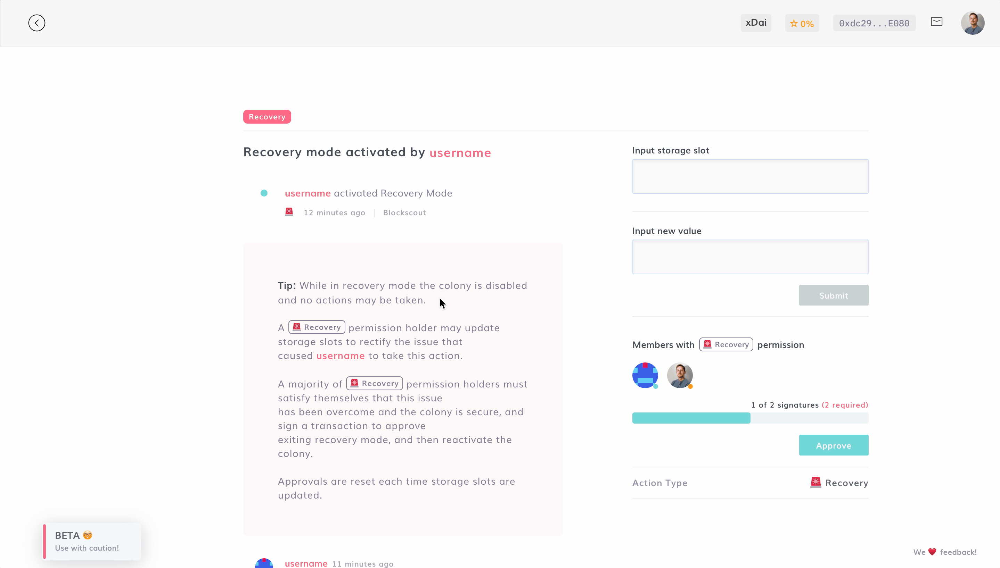
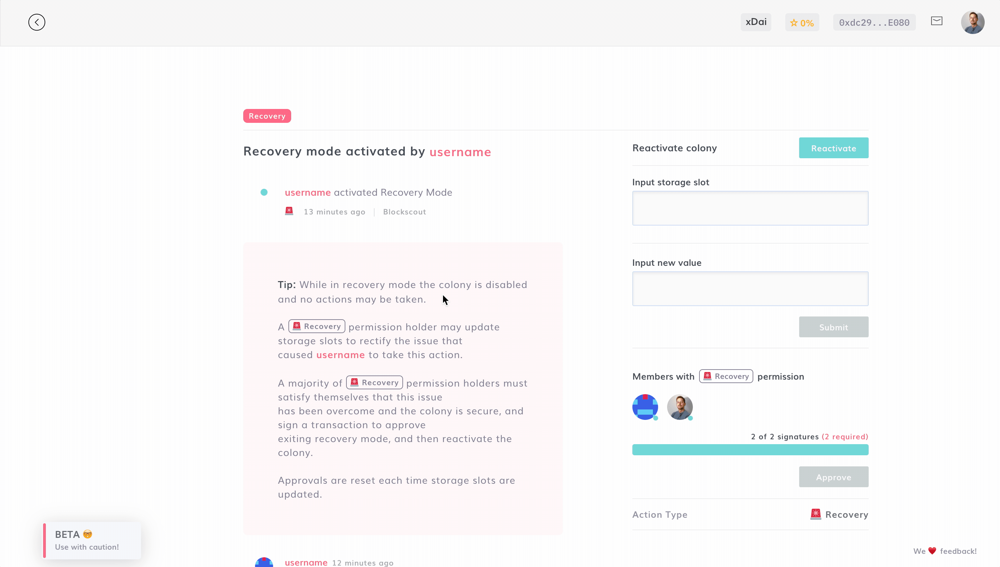

# Recovery Mode

If you believe that something dangerous is happening in your colony (e.g. it is under attack), recovery mode will disable the colony and prevent further activity until the issue is brought to resolution.

:::caution
Leaving recovery requires the approval of a majority of members holding the Recovery permission.
:::

### Activate Recovery Mode

To activate Recovery Mode, navigate to **New Action > Advanced > Recovery** and click Confirm after carefully reading the warning message.&#x20;

:::danger
While in recovery mode the colony is disabled and no actions may be taken.
:::

### Exit Recovery Mode

A Recovery permission holder may update storage slots to rectify the issue that caused the user to take this action.

The majority of Recovery permission holders must be assured that the issue is resolved and the colony is secure, and sign a transaction to approve exiting recovery mode. After that is done, the colony can be reactivated.

:::tip
Approvals are reset each time storage slots are updated.
:::

When enough permission holders have signed to exit recovery mode, as long as no further storage slots are updated, a recovery permission holder may now sign a transaction to reactivate the colony.

