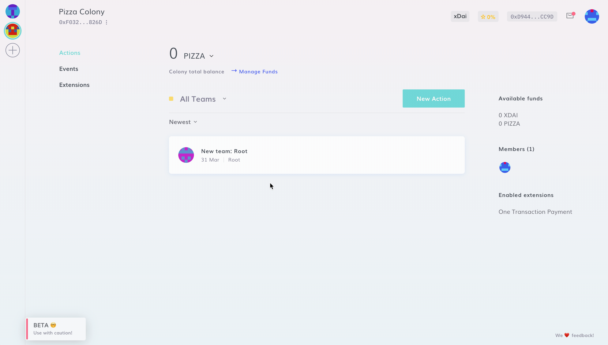

# Edit Colony Details

After you have created your colony, you can navigate to **New Action > Advanced > Edit Colony Details** to change your colony **name** and **logo**.


[Root](../advanced-features/permissions.md#root) permission is needed to edit the colony details.


You cannot change your colony URL or its [Native Token](select-native-token.md).
