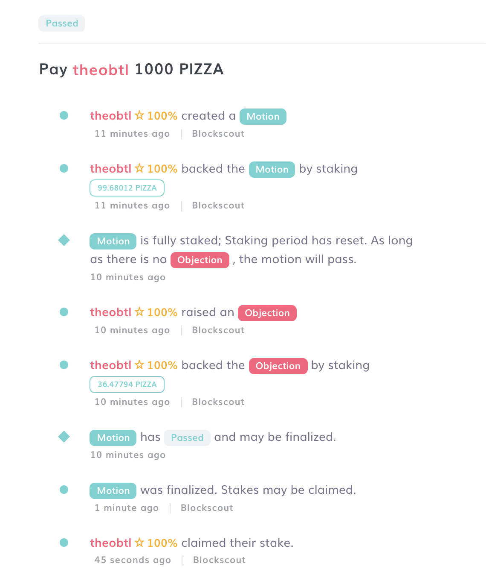
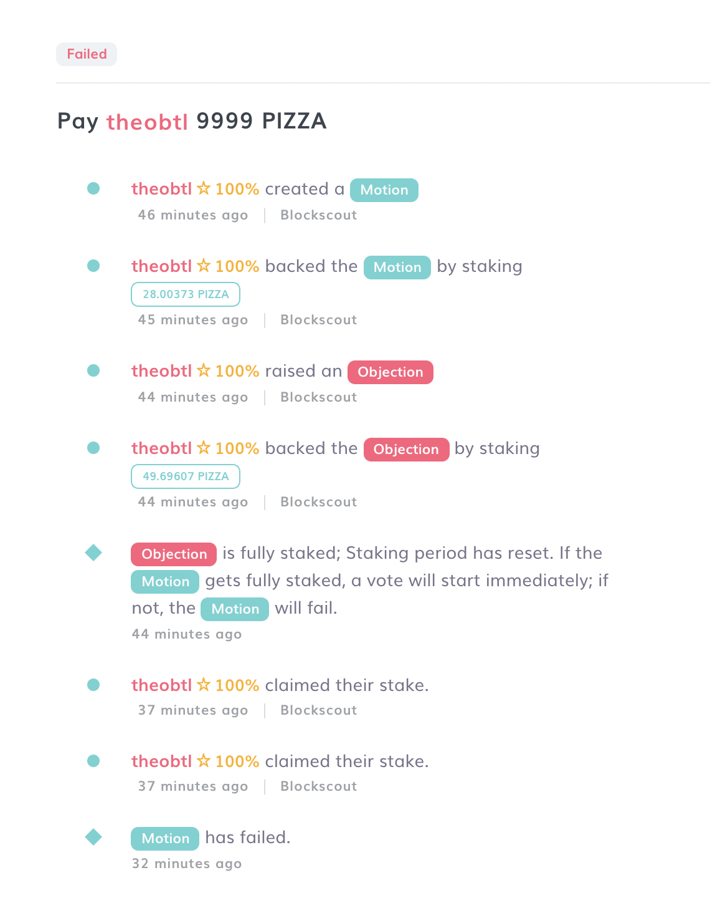

# Objecting and Creating a Dispute

Any member of your colony can Object to any Motion and force a vote (AKA a dispute) by staking in opposition to it.&#x20;

1\. Open the Motion with which you disagree and click on "Object" in the upper right-hand corner.

2\. Stake your own tokens and/or let other members of your colony stake their tokens on your Objection.

## Scenario 1: Motion is fully staked, but Objection is not

2a) If by the end of the staking period, the Motion is fully staked but the Objection is not or only partially, the Motion will pass.

## Scenario 2: Objection is fully staked, but Motion is not

2b) If by the end of the staking period, the Objection is fully staked but the Motion is not or only partially, the Motion will fail.

## Scenario 3: **Both** Motion and Objection are fully staked

### Voting Phase

2c) If both the Motion and the Objection are fully staked, voting starts immediately.&#x20;

Votes are secret (i.e. they're encrypted using your private key), and weighted by reputation. Vote weight is proportional to the voter's reputation in the team in which the vote is occurring.


Colony differs from other voting protocols by keeping votes secret during the voting phase. This is to avoid the risk of manipulation and cognitive bias that comes from voters being able to see the running tally of the vote before they cast their vote.


Voters receive a reward for voting proportional to their reputation in the team in which the vote is occurring. The reward comes from the stake provided by whichever side of the dispute loses. It doesn't matter whether the voter voters for the winning or the losing side, they are rewarded the same either way.

### Reveal Phase

4\. After the voting period is complete, the _Reveal_ phase starts. Votes must be _Revealed_ in order to be counted, and for the voter to receive their voter reward.&#x20;

The Reveal phase ends when either the time runs out, or everyone who has voted reveals their vote, whichever comes first.&#x20;

### Outcomes of a Vote

5a. If the `Yes` side wins, hitting the `Finalize` button will cause the Action that was Motioned for to take place and allow stakers to reclaim their funds. \
\
5b. If the `No` side wins, hitting the `Finalize` button will simply allow stakers to reclaim their funds.

##
