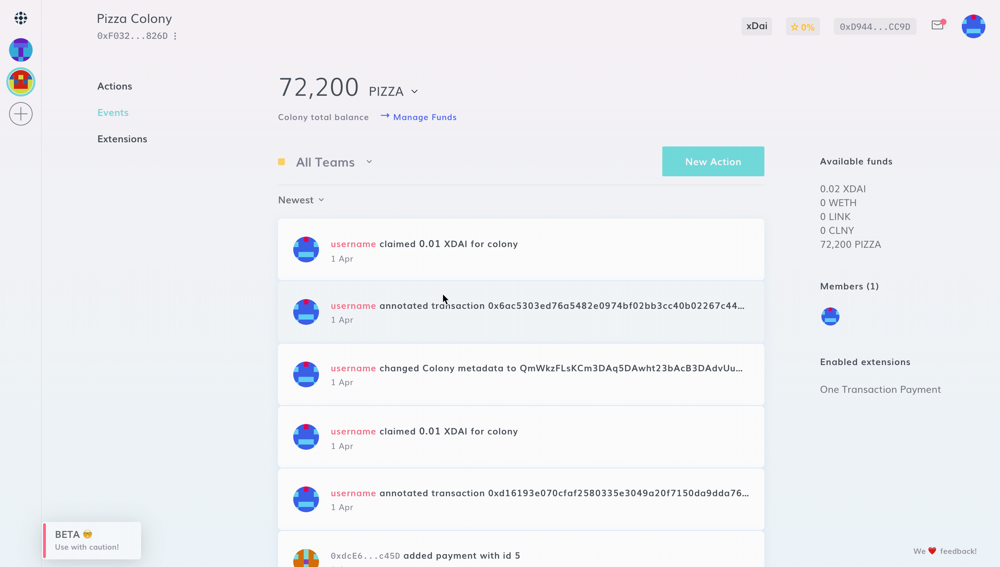

# Unlock Token

Your colony’s native token is locked and non-transferrable by default. This action allows you to unlock it so that it may be freely transferred between accounts. This feature is only available if the native token has been generated with Colony.

:::danger
Please note: this action is **irreversible**. Use with caution
:::

To unlock your native token, navigate to **New Action > Manage Funds > Unlock Token** and click "Confirm" **only after having carefully read and understood the warning message.**

:::note
This feature's purpose is to avoid unwanted project token transfer outside of the colony, i.e. on decentralized exchanges. 
:::

:::caution
Unlocking the native token requires you to have [Root](../advanced-features/permissions.md#root) permission.
:::
