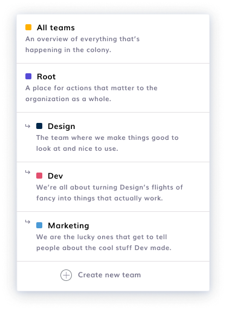

# Create & Edit Team

A colony is structured like a traditional organization: in **Teams**.

You'll always find **Root**, which is the "colony-wide team". You can decide to create as many teams as you wish, each representing a different area of your organization.

**Currently, you cannot create sub-teams, or delete teams.**

### Create New Team

To create a new Team, navigate to **New Action > Manage Teams > Create New Team**

You can decide the **Team** name, define its purpose, and explain why you are creating it. You can change a Team's details later, but **you cannot delete a Team.**

:::caution
[Architecture](../advanced-features/permissions.md#architecture) or [Root](../advanced-features/permissions.md#root) permissions are needed to create teams.
:::

### **Edit Team**

To make changes to a Team name & description, navigate to **New Action > Manage Teams > Edit Teams** to change the Team name & description.

:::caution
[Architecture](../advanced-features/permissions.md#architecture) or [Root](../advanced-features/permissions.md#root) permissions are needed to edit teams.
:::
