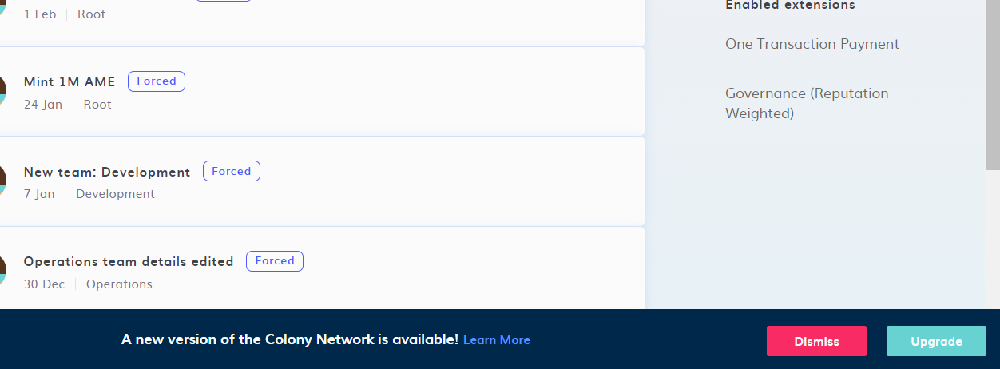
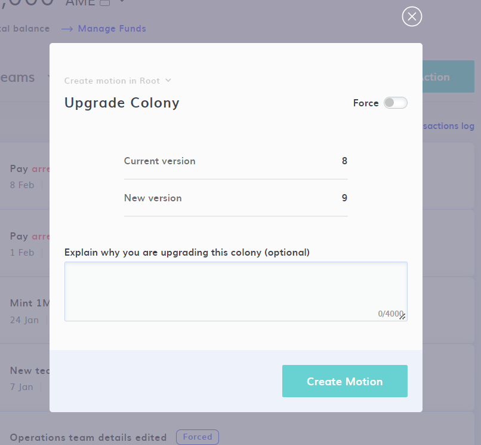
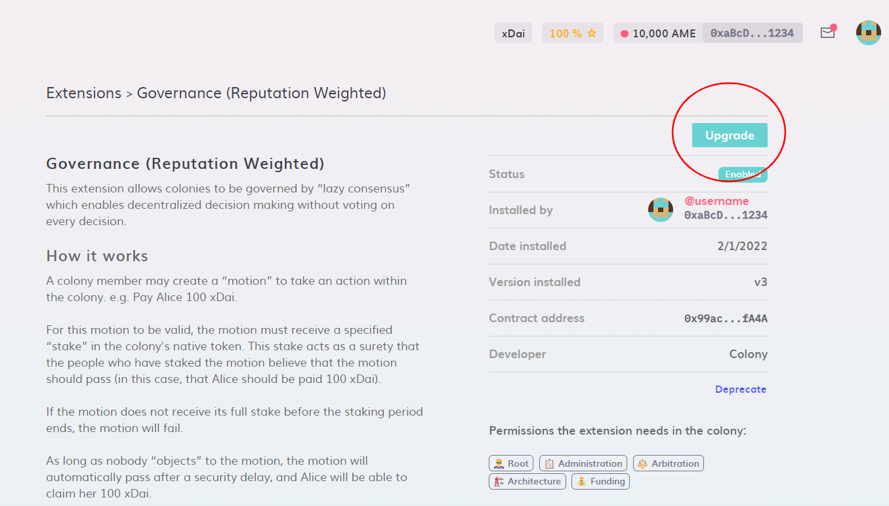

# Upgrade Colony and Extensions

Colony has been set up in a way that allows for functionality to be added over time, while your Colony contract itself is immutable on the blockchain, you are able to call new Colony contracts that are released which includes additional functionality.

Upgrading is completely optional, you're able to continue to use your existing contracts for as long as you like, they will never be removed.

### How to upgrade Colony

Upgrading is simple, you will likely see a banner on your Colony that informs you of the latest released version. Such as the below screenshot:

There is a 'Learn More' link in the banner with more details on the new version. Clicking on the 'Upgrade' button will give you a modal that allows you to upgrade. As of the below screenshot:

Upgrading your Colony is community decision, so, requesting an upgrade will require the Motion process. However, it can be forced if you have the permissions to do so.

Once upgrade, any new functionality will be available to you right away within your Colony. Although, it is not uncommon for Colony contract releases to happen before the features are made available in the UI.

### Upgrading Extensions

Upgrading your extensions will require you to check the extensions themselves. To do so you will navigate to your 'Extensions' page.

.png>)

You will then need to click into each extension to check if there is an option to upgrade it to a newer version. You can see this in the below screenshot.

Clicking the Upgrade button will create a transaction that upgrades the extension. If upgraded successfully, you will see the new version listed in the 'Version installed' row.

Any extensions that are not installed will not need to be upgraded, as it will auto install the latest version when it is installed.
